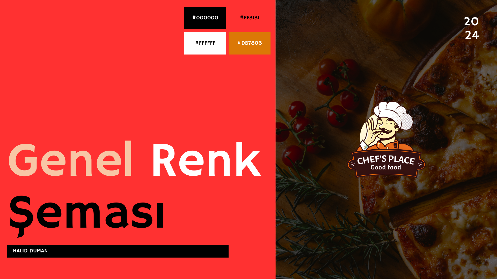
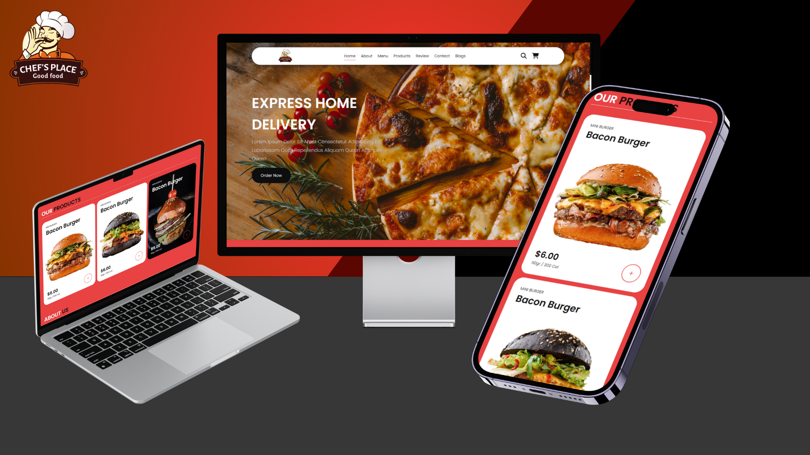

# Restaurant-website-2

    

Bu proje, bir işletme web sitesinin basit bir tasarımını içermektedir. Projede, hamburger, pizza ve benzeri ürünlerin yer aldığı bir tema kullanılmıştır. Web sitesi, tek sayfadan oluşmakta olup, aşağıdaki bölümleri içermektedir:

- **Home:** Ana sayfa, işletmenin tanıtımını ve öne çıkan ürünleri içerir.

- **About:** İşletme hakkında genel bilgilerin yer aldığı bölüm.

- **Menu:** İşletmenin sunduğu ürünlerin listelendiği menü bölümü.

 
- **Products:** Ürünlerin detaylı açıklamalarının ve görsellerinin bulunduğu bölüm.

- **Review:** Müşteri yorumlarının yer aldığı bölüm.

 
- **Contact:** İletişim bilgilerinin ve iletişim formunun bulunduğu bölüm.

- **Blogs:** İşletme ile ilgili blog yazılarının bulunduğu bölüm.
  

- **Footer:** web sayfasının en alt kısmında bulunan bölümdür. Site haritası, iletişim bilgileri gibi bilgiler içerir.

## Genel Renk Teması

Web sitesinin genel renk teması kırmızıdır. Kırmızı, sıcaklık, tutku ve enerji gibi duyguları çağrıştıran bir renktir. Bu nedenle, işletmenin enerjik ve dikkat çekici bir görünüm sergilemesi amaçlanmıştır.

## Responsive

Sitemiz, her cihazda mükemmel görüntüleme ve kullanım deneyimi sunar. Sayfalarımız, mobil, tablet, dizüstü ve masaüstü cihazlara uyumlu şekilde tasarlanmıştır.

## Kullanılan Teknolojiler

- html
- css
- javascript
---
Proje Ödevimi İncelediğiniz İçin Teşekkürler.
